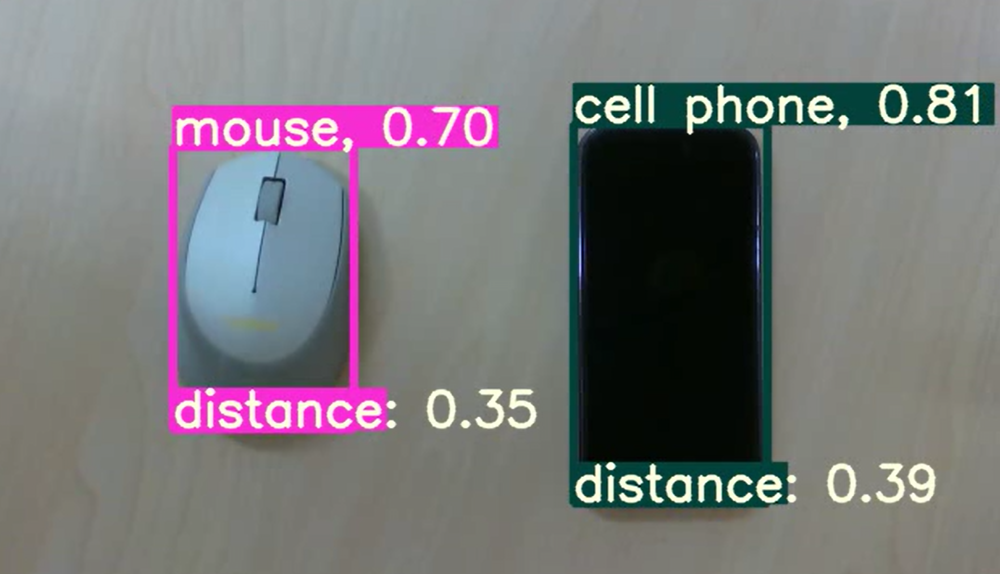

# combine RealSense D435i with YOLOV5
- use D435i for depth estimation
- run a YOLOV5 module for classification
- combine depth information with detected objects
- an example of results is shown below

